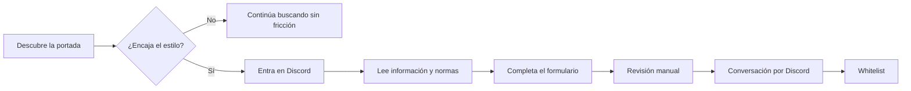

# Ferreras SMP — diseño de la web

> Documento vivo del sistema visual, la arquitectura de contenidos y las reglas de experiencia de Ferreras SMP.
>
> Estado: diseño implementado y documentado a partir del código actual, el documento de producto y una inspección visual local realizada el 9 de agosto de 2026.

## 0. Propósito y fuente de verdad

Ferreras SMP no necesita parecer el servidor más grande de Minecraft. La web debe ayudar a que una persona compatible reconozca el ambiente, entienda las condiciones de entrada y llegue a Discord con expectativas correctas.

La decisión de diseño central es esta:

> **Minecraft Vanilla técnico, hecho en comunidad.**

Cuando haya que tomar una decisión nueva, el orden de prioridad es:

1. Honestidad sobre el tamaño, el ritmo y las reglas del servidor.
2. Claridad del camino hacia Discord y el formulario de acceso.
3. Coherencia con el sistema editorial y visual existente.
4. Accesibilidad, legibilidad y buen comportamiento responsive.
5. Pulido visual sin añadir ruido ni sistemas innecesarios.

### Fuentes consultadas

- `PRODUCT.md`: posicionamiento, público, recorrido y arquitectura de la web.
- `src/styles/global.css`: tokens, tipografía, layout, componentes y breakpoints.
- `src/layouts/Layout.astro`: documento HTML, SEO, tema y scripts globales.
- `src/components/SiteHeader.astro`, `SiteFooter.astro`, `PageIntro.astro` y `ThemeIcon.astro`: patrones compartidos.
- `src/pages/` y `src/content/blog/`: estructura y contenido actual de las páginas.
- `public/images/`: marca, ilustraciones, capturas y portadas.
- Inspección visual local de la portada, `/servidor/` y el menú móvil.

Si este documento y una implementación futura entran en conflicto, primero se debe decidir si ha cambiado la estrategia del producto. Si no ha cambiado, se conserva este sistema y se corrige la implementación.

## 1. Objetivo de producto

### 1.1 Conversión principal

La conversión no es un registro web. Es:

1. Descubrir Ferreras SMP.
2. Entender si encaja con la persona.
3. Entrar en Discord.
4. Leer la información y las normas.
5. Completar el formulario de acceso.
6. Continuar la conversación y la revisión manual por Discord.

La web debe conducir a Discord sin fingir que la whitelist es automática ni que el servidor busca volumen.

### 1.2 Lo que debe comunicar en pocos segundos

- Es Minecraft Java, versión 26.2.
- La experiencia es cercana a Vanilla y técnica.
- Fabric y los mods están del lado del servidor; no hay modpack obligatorio.
- La comunidad es pequeña, tranquila y exigente con el respeto.
- El mundo es persistente y está pensado para proyectos a largo plazo.
- El siguiente paso es entrar en Discord, no rellenar un formulario aislado.

### 1.3 Lo que no debe sugerir

- Un servidor masivo o con actividad constante garantizada.
- Pay2Win, rangos, economía artificial o progresión personalizada.
- Un modpack obligatorio.
- Una comunidad adecuada para cualquier estilo de juego.
- Urgencia artificial, premios, contadores de plazas o marketing agresivo.

## 2. Audiencia, tono y contenido

### 2.1 Persona ideal

Persona mayor de 16 años que disfruta del Minecraft survival reconocible, las granjas técnicas, las construcciones cuidadas y las comunidades pequeñas. Puede jugar sola o colaborar, pero busca un mundo que conserve contexto y continuidad.

### 2.2 Voz

El tono es español de España, informal, cercano, serio y amable. La web habla como una persona responsable de una comunidad pequeña, no como una marca publicitaria.

Reglas de redacción:

- Explicar antes de prometer.
- Nombrar límites y condiciones sin esconderlos.
- Preferir frases concretas: “cliente Vanilla compatible”, “revisión manual”, “mundo persistente”.
- Usar humor ligero solo cuando no reste claridad.
- No utilizar superlativos vacíos como “el mejor”, “increíble” o “revolucionario”.
- Cuando una integración aún no exista, decir “por llegar” o “previsto”, nunca simular que está activa.
- Repetir Discord como siguiente paso cuando el contexto de la página lo justifique.

### 2.3 Jerarquía de copy

Cada pantalla debe poder leerse en este orden:

1. Eyebrow corto que ubica la página.
2. Titular editorial con una sola idea.
3. Lead que explica la promesa o el límite.
4. Evidencia: imagen, datos, pasos, reglas o artículos.
5. CTA contextual, normalmente hacia Discord o hacia la siguiente página informativa.

Los titulares pueden partirse en varias líneas. La palabra o concepto diferencial puede usar `--violet`, pero no se debe resaltar una frase completa si se pierde la lectura.

## 3. Arquitectura de información

La cabecera mantiene una navegación corta y prioriza las rutas de decisión. El pie de página contiene el mapa completo del sitio.

| Ruta | Papel | Patrón visual | Siguiente acción |
| --- | --- | --- | --- |
| `/` | Entrada editorial y filtro de compatibilidad | Hero visual + bloques editoriales | Entrar en Discord |
| `/servidor/` | Explicar filosofía, Vanilla, Fabric y permanencia | Page hero + prosa + ilustración lateral | Ver cómo entrar |
| `/como-entrar/` | Reducir incertidumbre sobre whitelist y pasos | Page hero + lista numerada + ilustración | Entrar en Discord |
| `/normas/` | Hacer explícitas las reglas de convivencia | Page hero + prosa estructurada | Preguntar en Discord si hay dudas |
| `/preguntas-frecuentes/` | Resolver objeciones antes del contacto | Page hero + acordeón `details` | Ir a Discord si queda una duda |
| `/blog/` | Dar contexto y captar búsquedas informativas | Page hero + grid de artículos | Leer un artículo o ir a Discord |
| `/blog/[slug]/` | Profundizar en un tema concreto | Cabecera de artículo + portada + prosa | Enlaces relacionados / acceso |
| `/galeria/` | Mostrar el mundo y su ambiente real | Mosaico editorial de capturas | Conocer el servidor / Discord |
| `/estado/` | Responder “¿puedo conectarme ahora?” | Tarjeta de estado + explicación | Cómo entrar |
| `/bluemap/` | Comunicar una integración futura sin fingirla | Empty state editorial + imagen | Galería o Discord |

### 3.1 Recorrido principal



### 3.2 Navegación global

#### Cabecera desktop

- Marca a la izquierda: icono cuadrado, nombre “Ferreras SMP” y subtítulo “Servidor Minecraft survival en español”.
- Navegación primaria: `Inicio`, `Servidor`, `Cómo entrar`, `Blog`.
- CTA destacado: `Entrar en Discord`.
- Control de tema al extremo derecho.
- La ruta activa se expresa con color de tinta y una línea violeta inferior.
- La cabecera tiene fondo semitransparente del color de papel y `backdrop-filter: blur(18px)`.

La cabecera no debe convertirse en un listado de todas las páginas. `Normas`, `Preguntas frecuentes`, `Galería`, `Estado` y `BlueMap` se descubren desde el pie, los enlaces contextuales y el contenido.

#### Cabecera mobile

- La marca conserva icono, nombre y subtítulo, pero reduce el icono a 42 px.
- El CTA de Discord se mueve dentro del menú desplegable.
- El control de tema permanece visible fuera del menú.
- El menú usa `<details>` y `<summary>` nativos para mantener una interacción sencilla y semántica.
- Al abrirse, el panel aparece alineado a la derecha, con fondo `--paper-strong`, borde, radio de 14 px y sombra.

#### Pie de página

El footer tiene cuatro zonas: identidad, `Conocer`, `Ver` y `Entrar`. Incluye las rutas secundarias, el dominio `mc.ferreras.dev`, el enlace a Discord y una línea final que recuerda el carácter pequeño y constante de la comunidad.

## 4. Dirección visual

### 4.1 Idea estética

La estética es **editorial bold, minimalista y profesional**. La web toma la materia visual de Minecraft —bloques, paisajes, personajes y pixel art— pero la ordena con una composición de revista digital:

- Mucho espacio de papel alrededor de las ideas.
- Titulares muy grandes y compactos.
- Reglas horizontales de 1 px para separar información.
- Etiquetas monoespaciadas y mayúsculas para orientar.
- Violetas precisos como acento de marca.
- Una sola imagen fuerte por sección importante.
- Secciones oscuras para crear ritmo y marcar el proceso de acceso.

No se busca una interfaz de videojuego con paneles, badges por todas partes o efectos de neón. Minecraft aparece en la imagen y en pequeños gestos gráficos; la estructura sigue siendo editorial.

### 4.2 Tokens de color

Los tokens viven en `src/styles/global.css`. El tema claro y el oscuro comparten nombres semánticos para que los componentes no dependan de colores literales.

| Token | Claro | Oscuro | Uso |
| --- | --- | --- | --- |
| `--paper` | `#f7f4ed` | `#101011` | Fondo principal |
| `--paper-strong` | `#fffdf8` | `#171619` | Tarjetas, paneles y secciones suaves |
| `--ink` | `#17151b` | `#f7f3eb` | Texto principal y superficies invertidas |
| `--muted` | `#625f67` | `#b8b2be` | Texto auxiliar y metadatos |
| `--muted-strong` | `#4e4a54` | `#d5ceda` | Párrafos y leads |
| `--line` | `rgba(23,21,27,.14)` | `rgba(247,243,235,.15)` | Divisiones suaves |
| `--line-strong` | `rgba(23,21,27,.27)` | `rgba(247,243,235,.30)` | Bordes y controles |
| `--violet` | `#7040f4` | `#7040f4` | CTA, enlaces activos y énfasis |
| `--violet-deep` | `#5b2bd7` | `#5b2bd7` | Hover del CTA |
| `--violet-soft` | `#e9e0ff` | `#2b1d57` | Callouts y menú abierto |
| `--yellow` | `#f1b718` | `#f1b718` | Icono y estados del control de tema |
| `--green` | `#5da551` | `#5da551` | Servidor online |

Reglas de uso:

- El violeta es el acento principal, no el color de fondo general.
- El amarillo aparece como detalle cálido y nunca compite con el CTA.
- El verde solo significa disponibilidad positiva del servidor.
- El estado offline usa un marrón rojizo apagado (`#b66d5b`) para no gritar “error”.
- Los bordes deben ser discretos. La jerarquía se construye primero con espacio, tamaño y contraste.

### 4.3 Tipografía

- Display y texto: `Manrope`, pesos 400–800, con fallback `Segoe UI`, sans-serif.
- Etiquetas técnicas, metadatos, dominios y códigos: `SFMono-Regular`, `Consolas`, `Liberation Mono`, monospace.
- El cuerpo parte de 16 px con `line-height: 1.55`.
- Los titulares utilizan peso 800, tracking negativo y líneas compactas.
- El hero usa `font-size: clamp(4rem, 4.6vw, 4.75rem)` y `line-height: .98` en desktop.
- Los titulares de sección usan `clamp()` y no deben fijarse a una escala que ignore el zoom del navegador.
- Los párrafos de lectura suelen limitarse a 630–760 px para evitar líneas demasiado largas.

La tipografía debe sentirse densa y segura en los titulares, pero nunca dificultar la lectura de la prosa. Las etiquetas monoespaciadas son señalización, no texto principal.

### 4.4 Layout, contenedor y ritmo

- Contenedor desktop: `width: min(100% - 110px, 1424px)`.
- Margen interno aproximado desktop: 55 px por lado como mínimo.
- El grid de portada tiene una altura mínima de 672 px.
- Las secciones genéricas usan `padding-block: 112px`.
- Las páginas interiores usan hero de `92px 0 86px` y contenido de `86px 0 120px`.
- Las líneas de separación se dibujan con `--line`, no con tarjetas gruesas.
- La composición alterna dos columnas, una columna de lectura y bloques de ancho completo.

El espaciado debe crear pausas visibles entre ideas. Cuando haya que compactar una pantalla, se reduce primero el espacio entre elementos secundarios, no el tamaño del cuerpo ni el ancho de lectura.

### 4.5 Bordes, radios y sombras

- CTA y controles: borde y radio de 10 px.
- Panel del menú mobile: radio de 14 px.
- Icono de marca desktop: radio de 19 px; tablet: 16 px; mobile: 11 px.
- La imagen editorial grande no necesita una tarjeta alrededor.
- Sombras solo en CTAs, marca y paneles flotantes; deben reforzar profundidad, no decorar cada bloque.
- La sombra compartida del sistema es `0 16px 40px rgba(35,25,62,.14)` en claro y una versión más profunda en oscuro.

### 4.6 Imagen y assets

La imagen es evidencia del mundo, no un fondo genérico. Se usan assets reales del repositorio:

- `public/images/blog/`: portadas de artículos y hero de la portada.
- `public/images/gallery/`: capturas del mundo para el mosaico.
- `public/images/brand/`: iconos, marca pixelada, mundo, aventurero y guía.
- `public/images/minecraft-map-item.png`: placeholder visual de BlueMap.
- `public/images/og-ferreras-smp.jpg`: Open Graph y previews.

Dirección de imagen:

- Priorizar escenas con construcciones, agua, caminos, cultivos y personajes reconocibles.
- Mantener una saturación ligeramente contenida para que el violeta siga siendo el acento.
- Usar `object-fit: cover` cuando la imagen sea una portada; respetar el recorte que mantenga el foco de la escena.
- Usar transparencias reales en ilustraciones de personaje; no simularlas con fondos de color.
- Todas las imágenes informativas deben tener `alt` descriptivo. Las miniaturas puramente decorativas pueden usar `alt=""`.
- No introducir iconos pixelados hechos a mano, emojis o cajas placeholder para sustituir assets reales.

### 4.7 Decoración

La portada utiliza una retícula violeta discreta en la esquina superior izquierda y dos pequeños cuadrados violetas. Es un gesto de orientación de marca, no un patrón que deba repetirse en todas las páginas.

La decoración nunca debe:

- competir con el titular;
- parecer un estado interactivo si no lo es;
- reducir contraste sobre el papel;
- sustituir información o navegación.

## 5. Componentes y patrones

### `Layout.astro`

Responsable del documento base:

- `lang="es"`, viewport, canonical y metadatos Open Graph.
- `theme-color` y manifest.
- Bootstrap temprano de tema desde `/theme-init.js`.
- Carga del comportamiento del control de tema desde `/theme-toggle.js`.

Cada página debe pasar `title`, `description` e `image` cuando no use los valores por defecto.

### `SiteHeader.astro`

Componente persistente de navegación. Debe conservar:

- marca accesible con `aria-label`;
- ruta activa mediante `aria-current="page"`;
- CTA externo de Discord con `target="_blank"` y `rel="noreferrer"`;
- control de tema visible y etiquetado;
- menú mobile semántico.

### `SiteFooter.astro`

Es la navegación secundaria y el cierre de la historia. Mantiene la misma marca que la cabecera, pero con un lockup más pequeño y una frase de producto completa.

### `PageIntro.astro`

Patrón de hero interior:

```text
eyebrow
Titular con una palabra en violeta
Lead explicativo
Imagen opcional con borde violeta lateral y nota técnica
```

Si hay imagen, ocupa la columna derecha con una relación visual cercana a 1.6:1. Si no hay imagen, el texto puede respirar en una composición más simple.

### `.button` y `.header-cta`

CTA sólido violeta, texto blanco, icono de Discord cuando corresponda, altura mínima de 48 px y hover con desplazamiento de 1 px. El CTA hero es mayor (`min-width: 290px`, `min-height: 64px`) para ser la acción dominante.

No se deben colocar dos CTAs de igual peso en el hero. Si hace falta una ruta secundaria, debe ser un enlace textual con subrayado o un enlace contextual posterior.

### Enlaces secundarios

Los enlaces de texto usan peso 800, subrayado o línea inferior y violeta únicamente en hover/focus cuando el contexto lo permite. La interacción debe ser evidente sin convertir cada bloque en un botón.

### `.eyebrow`

Etiqueta monoespaciada en mayúsculas, 0.72 rem aproximadamente, tracking positivo y color secundario. Sirve para clasificar, no para repetir el título.

### `.prose`

Columna de lectura de máximo 760 px:

- `h2` grandes y compactos;
- `h3` para subdivisiones;
- párrafos y listas a 1.02 rem aproximadamente y `line-height: 1.75`;
- enlaces violetas subrayados;
- código en pequeño bloque `--paper-strong` con borde;
- callouts con línea izquierda violeta y fondo `--violet-soft`.

### `.content-layout` y rail lateral

En páginas de información, la estructura es una columna lateral para índice, ilustración o contexto y una columna principal de lectura. La ilustración puede ser sticky en desktop y vuelve a flujo normal en tablet/mobile.

Cuando el lateral solo sea informativo, debe estar visualmente subordinado al contenido y no competir con el primer `h2`.

### Cards de blog

Las cards no son paneles con sombra. Usan:

- línea superior de 1–2 px;
- imagen con relación 1.6:1;
- categoría y fecha en mono violeta;
- titular corto;
- descripción de una o dos frases;
- desplazamiento vertical de 4 px en hover.

Las tres cards de la portada funcionan como una muestra editorial; el índice del blog reutiliza el mismo patrón en una cuadrícula más amplia.

### Status card

La tarjeta de estado comunica una sola pregunta: “¿está disponible y cuánta gente hay?” Incluye:

- nombre del servidor;
- indicador textual `Online`, `Offline` o `Comprobando`;
- punto de color con estados loading/online/offline;
- número grande de jugadores y máximo;
- dominio de conexión;
- explicación editorial a la derecha.

La pantalla debe tener estados estables para carga, respuesta online, respuesta offline y datos incompletos. Nunca se deben mantener números viejos cuando la consulta falla.

### FAQ

Se usa `<details>` con un `summary` de fila completa. El icono textual `+` cambia a `−` cuando está abierto. Solo una pregunta inicial debe aparecer abierta para mostrar la interacción sin desplegar toda la página.

## 6. Especificación por página

### 6.1 Inicio `/`

#### Orden de secciones

1. Header global.
2. Hero.
3. Declaración de compatibilidad: “No es para todo el mundo”.
4. Proceso de acceso en sección oscura.
5. Datos técnicos del servidor.
6. Artículos destacados.
7. Footer.

#### Hero

- Fondo de papel.
- Copy a la izquierda, con padding lateral interior.
- Imagen de mundo persistente anclada a la derecha y fundida hacia el papel mediante máscara y overlay.
- Titular en cuatro líneas: `Minecraft / Vanilla técnico, / hecho en / comunidad.`
- `comunidad.` en violeta.
- Lead: mundo pequeño para construir, automatizar y quedarse.
- Un único CTA principal a Discord.
- Estado del servidor debajo del CTA.
- Caption oscura sobre la imagen, alineada abajo a la derecha.

El hero debe resolver identidad y acción sin obligar a hacer scroll. La imagen se encarga de demostrar ambiente; el copy se encarga de filtrar.

#### Declaración

La marca de trigo y tierra introduce la idea de mundo cuidado. El texto explica lo que no hay: economía, Pay2Win, plugins que cambien la experiencia. Esta sección es una pieza de posicionamiento, no un bloque de características.

#### Proceso de acceso

Fondo `--ink`, texto claro y tres filas numeradas:

1. Entrar en Discord.
2. Completar el formulario.
3. Hablar con el equipo.

La estructura en filas permite comparar cada paso de un vistazo. Los enlaces de cada fila son secundarios y no deben competir con el CTA del hero.

#### Base técnica

Titular a la izquierda y definición de cuatro datos a la derecha: edición, servidor, estilo y dirección. El dominio se representa como código para que se pueda copiar visualmente sin confundirlo con una frase.

#### Artículos

Sección de papel fuerte con tres cards. El contenido debe responder dudas reales antes de que la persona entre en Discord.

### 6.2 El servidor `/servidor/`

Usa `PageIntro` con la promesa “Minecraft sin adornos.”, imagen del mundo y nota `Java 26.2 · Fabric · cliente Vanilla compatible`.

El cuerpo utiliza la ilustración transparente del aventurero en el rail lateral y prosa larga en la columna principal. El orden argumental es:

1. El mundo no tiene prisa.
2. Fabric existe para rendimiento y calidad de vida.
3. Qué sí se encuentra.
4. Qué no se encuentra.
5. CTA para ver cómo entrar.

### 6.3 Cómo entrar `/como-entrar/`

Usa `PageIntro` con tono de filtro: “Si te encaja, nos conocemos.” El cuerpo presenta el camino hasta la whitelist como una lista ordenada, seguido de un callout con las preguntas del formulario y una lista de requisitos.

La información crítica que nunca debe quedar escondida:

- primero se entra en Discord;
- hay que leer información y normas;
- la solicitud se revisa manualmente;
- el cliente Vanilla puede conectarse sin modpack;
- la dirección se entrega como `mc.ferreras.dev`.

El CTA final vuelve a ser Discord y lleva icono de Discord.

### 6.4 Normas `/normas/`

Page hero sin imagen para reducir distracción. La prosa se divide por situaciones reales:

- trato y convivencia;
- construcciones y objetos;
- duplicación;
- PvP;
- incidentes y apelaciones.

La redacción debe ser directa y acompañarse de ejemplos cuando exista una distinción fácil de malinterpretar, como objetos renovables frente a TNT o arena.

### 6.5 Preguntas frecuentes `/preguntas-frecuentes/`

Page hero sin imagen y lista de acordeones. Las preguntas cubren instalación de mods, versión, whitelist, ritmo de juego, PvP, reinicio del mundo y resolución de robos o daños.

La primera respuesta debe aparecer abierta. Cada `summary` debe ser suficientemente claro por sí mismo y mantener un área de interacción cómoda en mobile.

### 6.6 Blog `/blog/`

El blog funciona como superficie de contexto y adquisición orgánica. El hero dice que los artículos se actualizan cuando cambia la experiencia real y que lo no confirmado se marca como tal.

El índice usa la colección de contenido `blog`, filtra borradores y ordena por `publishedAt` descendente. Cada entrada muestra categoría, fecha localizada, portada, título y descripción.

### 6.7 Artículo `/blog/[slug]/`

El artículo tiene una cabecera amplia con categoría y fecha, titular, descripción y portada a ancho completo. Debajo, el layout vuelve a dividirse entre un rail con enlace de retorno y una columna `.prose`.

El Markdown debe mantener:

- títulos jerárquicos;
- listas y pasos legibles;
- enlaces externos con contexto;
- enlaces internos a normas, FAQ y acceso;
- una portada que represente el tema sin repetir el hero de la web.

### 6.8 Galería `/galeria/`

La galería usa un grid de 12 columnas:

- primera imagen: 5 columnas;
- segunda: 7 columnas;
- tercera: desplazada a partir de la columna 2 y ocupa 7;
- siguientes: continúan el ritmo editorial.

Cada item tiene altura mínima de 310 px, imagen a `object-fit: cover` y caption flotante con fondo negro translúcido. En mobile todo pasa a una columna de 240 px mínimos.

La selección de imágenes es manual y debe priorizar variedad: fortaleza, costa, Nether, caminos, casas y refugios.

### 6.9 Estado `/estado/`

La página combina una tarjeta funcional con explicación de producto. La tarjeta consulta `/api/server-status`, que hace ping directo a Minecraft, respeta SRV, cachea brevemente y devuelve online/offline.

Estados de UI:

| Estado | Punto | Texto | Números |
| --- | --- | --- | --- |
| Loading | Gris con pulso | Comprobando | Guiones |
| Online | Verde | Online | Jugadores actuales y máximo |
| Offline | Marrón rojizo | Offline | Guiones |

El texto debe comunicar la pérdida de datos cuando la consulta falla. El futuro puede añadir latencia y cabezas de jugadores, pero no debe sobrecargar la tarjeta actual.

### 6.10 BlueMap `/bluemap/`

Es un empty state honesto. El titular informa de que el mapa está por llegar; la imagen de mapa de Minecraft sirve como expectativa visual, no como falsa integración.

El cuerpo deriva a la galería y a Discord. Cuando BlueMap esté activo, la página debe evolucionar a una vista funcional conservando el mismo encabezado, tono y CTA de respaldo.

## 7. Responsive y reflow

Los breakpoints actuales son parte del contrato visual:

| Rango | Comportamiento |
| --- | --- |
| > 1140 px | Navegación completa, hero de dos zonas, grids amplios |
| ≤ 1140 px | Se reducen gaps de nav y se comprimen columnas intermedias |
| ≤ 940 px | Aparece menú mobile, la cabecera baja a 92 px, hero e interiores pasan a una columna, blog a dos columnas |
| ≤ 620 px | Margen horizontal de 15 px, cabecera de 76 px, logo de 42 px, CTAs del hero a ancho completo, grids de blog a una columna |

Reglas específicas:

- El hero desktop usa imagen absoluta; desde 940 px la imagen vuelve al flujo y se muestra debajo del copy con una altura aproximada de 430 px.
- En mobile el hero visual baja a 300 px y pierde la máscara compleja para priorizar la imagen completa.
- El `h1` del hero mantiene escala fluida con `clamp()` y tracking más cerrado.
- Las acciones del hero pasan a columna y ocupan todo el ancho.
- El rail de ilustración deja de ser sticky y se coloca antes de la prosa.
- Las listas de datos pasan de dos columnas a una.
- Las filas del proceso pasan de cuatro columnas a dos; número y título quedan arriba y descripción/enlace debajo.
- La galería y el blog pasan a una sola columna.
- La tarjeta de estado apila su encabezado y su dominio para no comprimir texto.
- El footer pasa de cuatro columnas a dos y después a dos columnas estrechas con gaps reducidos.

La verificación local del 9 de agosto confirmó `406 × 823` CSS en mobile sin overflow horizontal, navegación desktop oculta y menú mobile visible.

## 8. Interacciones y estados

### 8.1 Tema

El control tiene tres preferencias y rota en este orden:

```text
sistema → claro → oscuro → sistema
```

Implementación y contrato:

- Preferencia persistida en `localStorage["ferreras-theme"]`.
- Preferencia expuesta como `data-theme-preference` en `<html>`.
- Tema resuelto expuesto como `data-theme`.
- `theme-init.js` corre antes del contenido para evitar un flash de tema durante SSR/prerender.
- `theme-toggle.js` actualiza el icono, el texto accesible y `meta[name="theme-color"]`.
- Si `localStorage` no está disponible, la página sigue funcionando con la preferencia del sistema.
- El icono de sistema, sol o luna se genera con Font Awesome; no se usan caracteres decorativos.

El botón debe anunciar siempre la preferencia actual y la siguiente acción, por ejemplo: “Tema actual: oscuro. Cambiar a tema sistema”.

### 8.2 Servidor

- La portada muestra un estado resumido.
- `/estado/` muestra la tarjeta completa.
- El cliente consulta cada 60 segundos.
- La API responde con cache corto y evita enseñar cifras obsoletas cuando la consulta falla.
- Loading usa un pulso; `prefers-reduced-motion: reduce` elimina la animación.

### 8.3 Hover, focus y movimiento

- Transiciones habituales: 160 ms.
- Hover del CTA: cambio a `--violet-deep`, sombra algo mayor y desplazamiento de 1 px.
- Hover de card: desplazamiento vertical de 4 px.
- Hover de imagen de galería: escala máxima de 1.03.
- Focus visible: outline violeta de 3 px con offset de 3 px.
- Todos los efectos se reducen a casi cero con `prefers-reduced-motion: reduce`.

### 8.4 Enlaces externos

Discord se abre en pestaña nueva con `rel="noreferrer"`. El dominio de conexión se presenta como contenido copiable/legible, no como un enlace externo que distraiga del acceso.

## 9. Accesibilidad y robustez

Fortalezas que se deben conservar:

- HTML semántico con `header`, `nav`, `main`, `section`, `footer`, listas y `article`.
- Un `h1` por pantalla y jerarquía de headings en contenido.
- `aria-current` para navegación activa.
- `aria-label` en marca, navegación, controles de tema y tarjeta de estado.
- `role="status"` en el estado resumido de la portada.
- Alt descriptivo en imágenes informativas.
- Focus visible en enlaces y controles.
- Form controls con `font: inherit` para respetar la tipografía del sistema.
- Soporte de reducción de movimiento.
- Reflow sin overflow horizontal en la comprobación mobile realizada.

Antes de dar por buena una nueva pantalla se debe comprobar también con teclado, zoom del navegador, lector de pantalla y contraste real de los estados claro/oscuro. Las capturas visuales por sí solas no demuestran cumplimiento WCAG completo.

## 10. Arquitectura de implementación

| Área | Ubicación |
| --- | --- |
| Layout global, SEO y tema | `src/layouts/Layout.astro` |
| Tokens y todos los patrones CSS | `src/styles/global.css` |
| Cabecera | `src/components/SiteHeader.astro` |
| Footer | `src/components/SiteFooter.astro` |
| Hero interior reutilizable | `src/components/PageIntro.astro` |
| Iconos de Discord y tema | `src/components/DiscordIcon.astro`, `ThemeIcon.astro` |
| Bootstrap y persistencia de tema | `public/theme-init.js`, `public/theme-toggle.js` |
| Estado client-side | `public/server-status.js` |
| Consulta Minecraft | `src/lib/minecraft-status.ts`, `src/pages/api/server-status.ts` |
| Contenido Markdown | `src/content/blog/` |
| Schema del blog | `src/content.config.ts` |
| Assets visuales | `public/images/` |

La web debe seguir siendo una aplicación Astro orientada a contenido. No introducir un CMS, una librería de componentes pesada o una capa de estado global para resolver problemas que ya cubren Astro, CSS y pequeños scripts.

## 11. Deudas y puntos a vigilar

Estas notas describen el estado de la implementación observada; no son una invitación a rediseñar todo:

1. `content-index` aparece en normas, FAQ y artículos, pero no tiene reglas globales equivalentes a `content-art`. Si se quiere mostrar un rail visual consistente, hay que definirlo explícitamente antes de usarlo como patrón.
2. Las cards del índice del blog usan `h2`, mientras que la portada usa `h3` y el CSS está definido principalmente para `.post-card h3`. Conviene normalizar la variante tipográfica para evitar márgenes o escalas del navegador.
3. La portada mantiene un array local de artículos destacados, mientras que `/blog/` usa la colección Markdown. Si cambian títulos o imágenes, ambas fuentes pueden separarse; la intención visual debe mantenerse aunque se unifique la fuente de datos.
4. El nav principal es deliberadamente corto y el footer es completo. Si se añaden rutas nuevas, hay que decidir primero si son tareas primarias o secundarias; no llenar la cabecera por defecto.
5. La fuente Manrope llega por `@import` de Google Fonts. Debe conservarse un fallback local razonable para que una carga externa lenta no rompa la composición ni la legibilidad.
6. El estado real del servidor depende de red y del ping de Minecraft. La UI offline es un estado válido y debe seguir diseñado, probado y legible.

## 12. Criterios de aceptación para futuras iteraciones

Una nueva pantalla o cambio visual está alineado si cumple lo siguiente:

- Explica una sola idea principal en el primer viewport.
- Mantiene el papel de Discord como conversión principal.
- Usa los tokens existentes y no introduce un color de marca paralelo.
- Reutiliza `SiteHeader`, `SiteFooter`, `PageIntro`, `.prose`, `.button` y el sistema de líneas cuando el patrón encaja.
- Tiene una jerarquía de headings clara y una columna de lectura razonable.
- Conserva el tratamiento editorial de imágenes reales del mundo.
- Define loading, empty, error/offline y estado activo cuando la pantalla lo necesita.
- Funciona a 406 px CSS sin overflow ni texto ilegible.
- Funciona con tema sistema, claro y oscuro.
- Tiene focus visible, labels y alt text adecuados.
- Respeta la reducción de movimiento.
- No añade una segunda CTA de igual peso sin una razón de producto.
- Se verifica en la ruta real a desktop y mobile antes de considerarse terminado.

### Checklist rápido de revisión visual

1. ¿El titular se entiende sin leer toda la pantalla?
2. ¿La imagen apoya la historia y está bien recortada?
3. ¿La acción siguiente es evidente?
4. ¿El espacio en blanco separa ideas o deja zonas accidentales?
5. ¿Los bordes y radios siguen siendo discretos?
6. ¿La paleta mantiene el papel, la tinta y el violeta como ejes?
7. ¿La versión oscura conserva contraste y profundidad?
8. ¿La navegación activa y el estado del servidor son comprensibles?
9. ¿El contenido sigue siendo honesto si la persona no encaja?
10. ¿La pantalla sigue pareciendo Ferreras SMP aunque se eliminen las imágenes?
